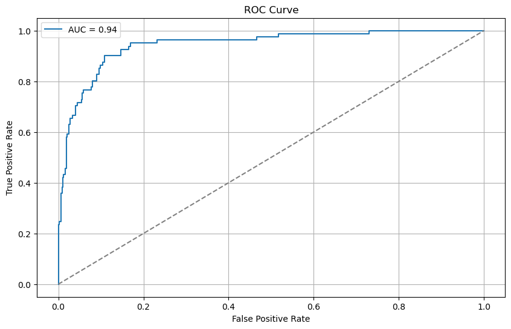
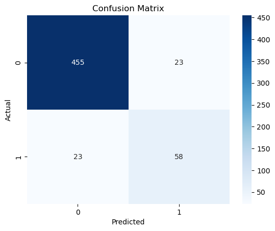
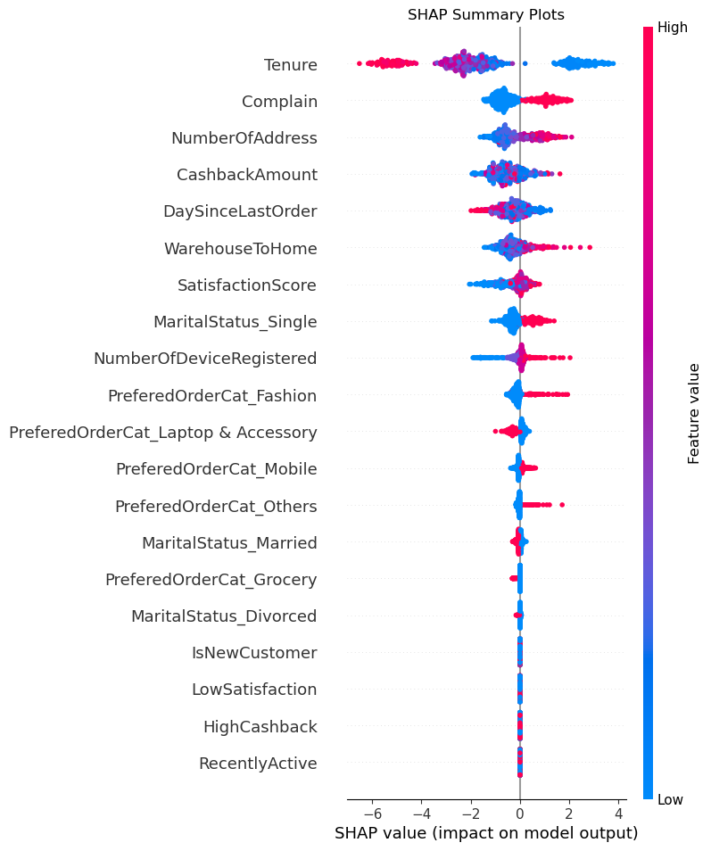

# E-Commerce Customer Churn Prediction

This Project predicts customer churn for ecommerce platform using machine learning. The goal is to identify customers likely to stop using that service so that proactive retention strategies can be applied

---

# Problem Statement

Customer churn is a major challenge for ecommerce businesses. By leveraging historical customer data, we aim to build a
proactive model that classifies whether a customer is likely to churn.

---

## Dataset

The Dataset includes features such as:

-`Tenure` - Number of months the customer has been with the company
-`WarehouseToHome` - Distance Between Warehouse and Customer's home
-`SatisfactionScore` - Customer Satisfaction (1 to 5)
-`CashbackAmount` - Cashback earned by Customer
-`PreferredOrderCart`, `MaritalStatus`, etc.

**Target Variable**: `Churn` (1 = churned, 0 = retained)

---

## Project Structure
```ecommerce-churn-prediction/
│
├── data/
│ ├── raw/
│ ├── processed/
│
├── models/
│
├── notebooks/
│ ├── 01_eda.ipynb
│ ├── 02_features_model.ipynb
│ ├── 03_evaluation.ipynb
│
├── plots/
│ ├── roc_curve.png
│ ├── shap_summary_plot.png
│ └── confusion_matrix.png
│
├── .gitignore
├── requirements.txt
├── README.md
```
---

## Data Preprocessing

- Removed Missing Values
- Dropped Duplicates
- Converted Categorical Variables
- Feature Engineering
- Balanced Class Distibution using `scale_pos_weight`

---

## Models Tried

----------------------------------------------------------------------
| Model                   | Accuracy | F1 Score (Class 1) | AUC      |
|-------------------------|----------|--------------------|----------|
| Logistic Regression     | 0.90     | 0.60               | 0.83     |
| Random Forest           | 0.91     | 0.64               | 0.86     |
| **XGBoost**             | **0.92** | **0.72**           | **0.94** |
----------------------------------------------------------------------

- **XGBoost** performed best and was selected for final deployment.

---

## Evaluation Metrics

- Confusion Matrix
- Classification Report
- ROC AUC Curve
- SHAP Explainability

## ROC Curve


## Confusion Matrix


## SHAP Sumamry Plot


## Model Deployment
model saved as :
    models/xgboost_model.pkl

---

## Requirements

Install Packages:
```bash
pip install -r requirements.txt
```
key Packages
- pandas
- numpy
- scikit-learn
- matplotlib / seaborn
- xgboost
- shap


## Future Improvement
- Better hyperparameter tuning
- Deploy via Stremlit dashboard
- Scheduled retraining on fresh data

## Author
### Akshay Gite
Aspiring Data Scientist | ML & AI Practitioner

